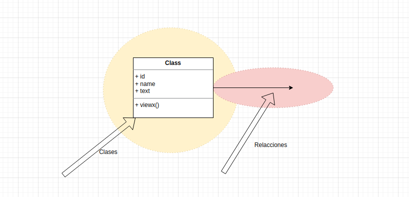

# ¿Cuáles son las partes de un diagrama de clases?

Un diagrama de clases está dividido en **dos partes, las clases, y la relaciones**, a su vez cada clase está compuesta por **tres elementos que son nombre, atributos y operaciones**. 

Así expresado no nos dice nada, pero si lo ponemos en contexto seguro que empezamos a visualizarlo, **un diagrama de clases nos permite visualizar completamente la estructura del sistema,** las tablas que lo componen, las relaciones entre esas tablas y nos da la opción de modelar la base de datos realizando las mejores prácticas, como la normalización de la base de datos. Si lo construye antes de construir todo el sistema, encontrará que tendrá un enfoque mucho más organizado para modelar sus bases de datos.

Pongamos un ejemplo de lo que es una clase por sí sola y como forma el diagrama de clases. Un dato más, el diagrama de clases es el más común y popular que verás, te permite como hemos dicho a simple vista ver como está armado el sistema.

Un diagrama de clases **se adapta muy bien a un sistema de modelado de bases de datos.** Si está intentando iniciar un **nuevo proyecto, un punto de partida habitual es elegir qué tipo de datos desea, cómo quiere que se asocien esos elementos entre sí y algunas de las operaciones principales.**

Los **elementos que componen un diagrama de clases son Name, Attributes, y Operations.**

Una gran ventaja de usar diagramas de clases es que **si le dieras un diagrama de clase a un administrador de base de datos, sabría lo que necesita para crear un esquema**, crear una tabla de base de datos, sabría qué atributos darle y podría copiar y pegar cada uno de estos elementos para desarrollarlo.

Los atributos y las operaciones tienen tres elementos diferentes que debes incluir. Visibilidad (pública/protegida/privada se puede indicar con un signo más/almohadilla/menos), el pequeño signo más significa que la operación/método/función está disponible para clases externas, si añadimos un pequeño signo menos, eso significaría que se trata de una operación/método/función que solo está disponible para el tema, y como detallamos anteriormente la almohadilla nos declara que la opción es privada para la clase, el nombre es la parte más explicativa y no tiene ninguna opción de visibilidad, es específico y cuanto más explicación por sí solo nos ofrezca mejor.

**Las operaciones son métodos o funciones. Además, las operaciones siempre van seguidas de paréntesis.**

# ¿Los diagramas de implementación son estructurales o conductuales?

Lo primero, definir lo que son diagramas de estructura o de conducta. UML divide en dos tipos básicos los diagramas o mejor dicho las representaciones visuales de los elementos que componen un sistema, están los elementos que corresponden a la estructura, arquitectura como el propio código, tenemos los diagramas de paquetes que nos ayudan a organizarlo, o tenemos el diagrama de clases que nos imprime un mapa de la base de datos en consecuencia tenemos un mapa de la estructura del sistema, y por supuesto tenemos los diagramas de implementación que nos reflejan los elementos incluso físicos del montaje del sistema. Y luego muy alejado de estos elementos UML nos presenta los diagramas de conducta que expresa muy bien lo que nos permite, presentar las acciones, las decisiones, las comunicaciones o las interacciones que tiene el sistema con sus actores, ya sean usuarios, administradores, posibles compradores, en definitiva nos habla de las conductas que tenemos que proveer y resolver sobre el papel antes de implementar el propio código.

Como expresión más técnica tenemos que los diagramas estructurales son cualquier tipo de diagrama que modela la forma en que se diseña un sistema, tal como los diagramas de clase, o los diagramas de paquetes,  por sí mismo estos diagramas nos permiten visionar la distribución de elementos estructurales dentro de todo nuestro sistema tal como equipos, servidores de aplicación, balanceadores, servidores de bases de datos y conexiones externas que pudieran establecerse. Este tipo de diagrama nos permite representar un sistema de integración continua tal como la metodología DevOps nos indica, siendo su objetivo principal guiar y proteger tu implementación, evitando una implementación accidental de algo que apague todo el sistema.

Y luego tenemos los diagramas de conducta donde podemos incluir a los diagramas de actividad, caso de uso, secuencias, estado de máquina. Los diagramas de comportamiento se ocupan de cómo se comporta el sistema. Se ocupan de diferentes cosas, como qué tipo de mensajes envía un sistema a otro o qué tipos de permisos tiene el usuario A en comparación con el usuario B. Esos son los tipos de preguntas que se van a modelar dentro de los sistemas de comportamiento.

Los diagramas de implementación pertenecen a los diagramas de estructura, tal como los diagramas de clase, o los diagramas de paquetes, por sí mismo estos diagramas nos permiten visionar la distribución de elementos estructurales dentro de todo nuestro sistema.

Los diagramas de implementación se componen de seis elementos diferentes.

- Nodes
- Components
- Artifacts
- Links
- Dependencies
- Associations

# ¿Qué es un diagrama de actividad?

El diagrama de actividad podría ser un buen punto de partida para comenzar un nuevo proyecto, nos permite decidir o mejor diría, nos permite manejar el flujo de la aplicación y dividirlo en fragmentos más pequeños y manejables, son ideales para mostrar a usuarios no técnicos. 

Evidentemente, si los podemos mostrar a usuarios no técnicos, es que son diagramas sencillos de entender y de explicar con una sintaxis agradable, que nos permita entendernos a todos los interesados en la aplicación.

Los elementos que lo componen son Estados inicial o punto de partida, estado de actividad o acción, flujo de acción, decisiones o ramificaciones, protectores, estado final o punto final.

Con este conjunto de elementos podemos representar todas las conductas que un usuario puede tener con el sistema, tal como hemos visto son diagramas de conducta, por lo tanto, no nos interesan nombre de atributos, métodos, código, ni nada por el estilo, solo mostramos, dibujamos la conducta que tendrán los distintos perfiles de usuario con el sistema, su actividad de principio a fin. 

Este tipo de diagrama es de alto nivel, no profundiza en nada más, acciones, decisiones, mensajes, todo lo relacionado con las relaciones entre el actor y el sistema. Las relaciones que debemos expresar por ejemplo en una página web de compra de productos, definiríamos los tipos de búsqueda que pueda tener el usuario, definiríamos que ocurre cuando hace clic en un producto, definiríamos el tipo acción a realizar si decide incluir su nuevo artículo en un carrito de compra, mostraríamos la acciones desde la primera hasta la última acción que los usuarios pueden tener con el sistema.

Los elementos que nos permiten definir claramente estas acciones, son:

Tenemos un **estado inicial representado por ese círculo grueso que tiene el círculo blanco en el medio.** En un diagrama de actividades, así es como se representa cómo comenzará un usuario o sistema.

La siguiente parte es la **actividad o el estado de la acción.**

Esta es una parte bastante importante de un diagrama de actividades, **cada cuadro es una actividad o un estado. Otra sintaxis, según la herramienta UML que estés usando, tendrá bordes redondeados para cada uno de estos estados.**

El siguiente **elemento es el flujo de acción**. 

Cada vez que veas **una punta de flecha rellena, se trata de un flujo de acción. Significa que tomamos un dato y lo llevamos de un estado de acción a otro estado de acción y este flujo de acción es la forma en que están conectados. Cuando confirmas y haces una pregunta, se trata de un flujo de acción.**

El siguiente elemento de la lista son **las decisiones (también llamadas ramificaciones).**

**Un cuadrado en forma de diamante de 45 grados, que se denomina punto de ramificación o decisión. Representa una etapa de la aplicación en la que se debe tomar una decisión.** 

**Los protectores son las opciones de "no" o "sí".**

**Una situación en la que tiene muchas ramificaciones potenciales de una actividad, es posible que desee pensar en su diseño. Cuantas más ramificaciones o protecciones tengamos, mayor será el nivel de complejidad. Eso significa que si vuelve a cambiar algo en ese proceso, tendrá que completar ese cambio en todo el sistema**.

Ahora, el siguiente punto es nuestro **estado final.**

La mayoría de las veces, tendremos un estado final y **la especificación UML dice que cada diagrama de actividades debe tener un estado final. En este sentido, simplemente almacenaremos el resultado dentro de la base de datos del sistema y eso es todo.**

**La sintaxis para esto será un flujo de acción desde una actividad hasta el punto final. Tendrá una flecha que apunta a un círculo grande con un círculo negro más pequeño en el medio, lo que representa que ha llegado al final de esa actividad.**

**Esto resulta útil cuanto más complejo se vuelve un sistema y cuantos más actores hay en el proceso, conviene organizar todo el sistema de esta manera. De un simple vistazo, cualquiera podrá ver qué puede hacer el profesor, qué puede hacer el sistema y qué funciones y responsabilidades tendrá el estudiante.**

# ¿De qué manera el diseño del sistema ayuda al proceso de desarrollo?

Si entendemos el diseño del sistema como paso previo a cualquier proceso de desarrollo que sea escribir una sola línea de código, un buen diseño nos ayuda a conseguir nuestro objetivo, si por objetivo entendemos que deseamos tener una aplicación robusta, fiable, escalable y en definitiva una aplicación que cumpla con las mejores prácticas del desarrollo moderno de software.

Si comenzamos creando un buen diseño, estableciendo unos buenos diagramas que nos posibiliten la visualización de posibles fallos, que nos faciliten la aplicación de las mejores prácticas, si seguimos las pautas marcadas por UML que en su interior contempla la unificación que nos dice que cualquier persona que quiera utilizar uml le será fácil comunicarse con nosotros con lo cual posibilita la comunicación, en definitiva si seguimos los procesos marcados, nuestro objetivo será alcanzable. Si, por el contrario, nos lanzamos a escribir más código, podemos y casi con toda seguridad llegaremos a un punto que no tendremos una visión clara de lo que estamos haciendo y podemos llegar a tener que comenzar de nuevo, ya que nuestro código no tendrá lo que el objetivo busca, ser robusto, fiable, escalable, al revés será un bloque de código sin pies ni cabeza. 

Un buen diseño marca las pautas en el proceso, muestra tu forma de crear aplicaciones, demuestra como te enfrentas a posibles errores, es como cuando eras pequeño y tu madre te decía que recogieras la habitación con pautas, cada cosa ya tenía su sitio, sin pautas iba todo debajo de la cama y como buena usuaria tu madre eso ya lo sabía y como buen hijo, ya sabemos lo que teníamos después, utilizar estas herramientas que unifican la creación de sistema nos hace avanzar no solo un paso en nuestro crecimiento como desarrolladores, sino algunos más.

# ¿Por qué usaríamos un diagrama de implementación?

Esto también habla de uno de los aspectos más importantes de UML: te da un nivel de abstracción que es muy difícil de lograr con cualquier otra herramienta. 

Cuando hablamos de nivel de abstracción, lo que quiero decir es que elimino los detalles de implementación y elimino el código. Me concentro en el comportamiento o la estructura de alto nivel de un sistema.

Herramienta que me resulta increíblemente útil **antes de crear una aplicación**.

**Un diagrama de implementación te da la posibilidad de echar un vistazo a tu código desde un nivel muy alto. Podrías crear toda tu arquitectura de esa manera.**

Los diagramas de implementación **se componen de seis elementos diferentes.**

- **Nodes**
- **Components**
- **Artifacts**
- **Links**
- **Dependencies**
- **Associations**

Los diagramas de implementación **nos brindan la capacidad de modelar cómo debe configurarse toda la arquitectura de un sistema.**

Si tenemos una aplicación que tiene múltiples servidores, múltiples lugares donde podemos almacenar código y se va a comunicar con el sistema, **un diagrama de implementación es perfecto para configurarlo.**

El diagrama de implementación nos permite visionar como establecer métodos y las mejores prácticas en DevOps, como CI significa "integración continua". El objetivo principal, **CI es guiar y proteger tu implementación, evitando una implementación accidental de algo que apague todo el sistema.**

Otros diagramas que se relaciona mucho con el diagrama de implementación que como sabemos en un diagrama de tipo estructural, son los diagramas de secuencia son algunos de los diagramas más complejos y uno de los diagramas más importantes que aprenderemos, ya que se relacionan directamente con la implementación.

**Se relacionan con cómo debe funcionar el código. Si se hace bien, facilitará mucho la implementación del proyecto.**